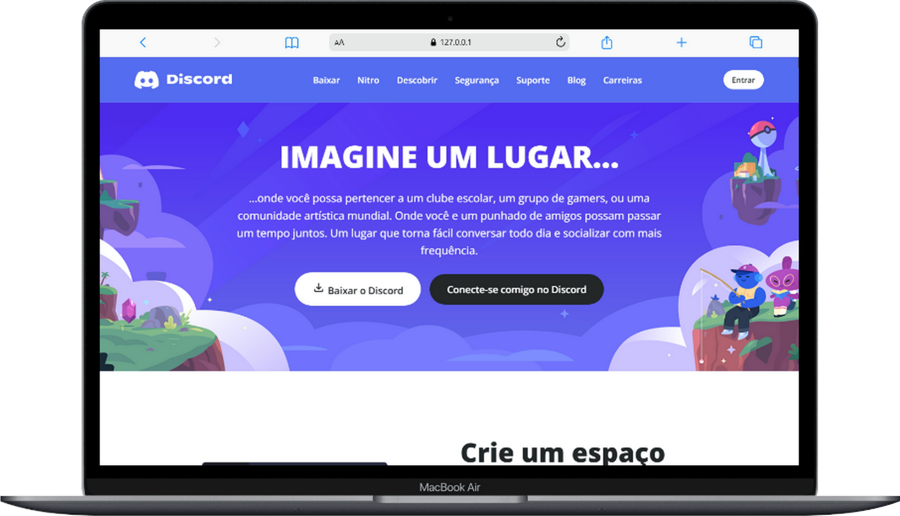
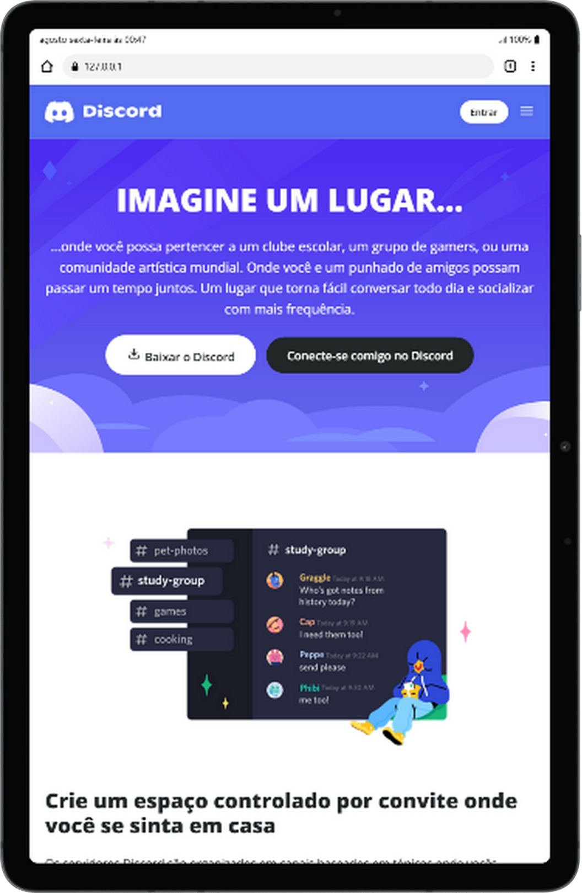

# 🚀 Desafio Santander: Clone da Landing Page do Discord 🎮

E aí, meu 🐙! Sinta-se em casa. Este é mais um repositório onde coloco em prática minha evolução como Desenvolvedora Front-End!

Este projeto foi desenvolvido com o objetivo de recriar a interface moderna de um site famoso (o Discord) e colocar em prática, de forma avançada, meus estudos sobre Responsividade (Mobile First) e Arquitetura CSS. Aqui, apliquei e consolidei conceitos cruciais para criar uma aplicação escalável, acessível e de fácil manutenção, referente ao desafio prático do **Módulo 4 - Trilha Posicionamento De Elementos com CSS**, oferecido pela [Digital Innovation One (DIO)](https://dio.me) em parceria com o **Santander Bootcamp 2025 - Front-End**.

---

## 🎥 Veja o Projeto em Ação!

Que tal dar uma olhada no projeto rodando ao vivo?
👉 [Acessar o Clone do Discord no ar](https://miriaamaral.github.io/desafio-css-discord/)

<br>
<div align="center">
    
    <br>
    
    
</div>
<br>

---

## 💡 Aprendizados e Funcionalidades Destacadas

Neste desafio, foquei em elevar o nível do código para padrões de mercado:

* Estruturei o CSS de forma modular, criando classes utilitárias (ex: `.d-flex`, `.flex-col`, `.align-center`) para evitar repetição de código. Isso deixou o CSS extremamente limpo e a manutenção do HTML muito mais ágil, inspirando-se em frameworks modernos como Tailwind e Bootstrap.
* O CSS foi construído primeiramente para telas menores. Utilizei `@media queries` com `min-width` para expandir o layout fluidamente para Tablets e Desktops.
* Utilização estratégica do Flexbox (`flex-direction: row-reverse;`) no Desktop para alternar o posicionamento de Imagem/Texto, mantendo tudo perfeitamente empilhado em formato de coluna no Mobile.
* Inclusão rigorosa de atributos `aria-label`, `aria-hidden` para ícones decorativos e tags semânticas (`<nav>`, `<main>`, `<section>`, `<footer>`), garantindo que usuários de leitores de tela compreendam 100% da interface.
* Uso da função `clamp()` no CSS para que os tamanhos das fontes cresçam e encolham automaticamente e de forma proporcional ao tamanho da tela.

---

## 🛠️ Tecnologias Utilizadas

* **HTML5:** Estruturação semântica e acessível.
* **CSS3:** Flexbox, Variáveis CSS (`:root`), Media Queries, Função Clamp e Classes Utilitárias.
* **Google Material Symbols:** Iconografia vetorial de alta performance.
* **Controle de Versão e Deploy:** Git e GitHub para versionamento estruturado (*Commits Convencionais*) e hospedagem contínua via GitHub Pages.

---

## ⚙️ Como Rodar o Projeto (Localmente)

1. **Clone este repositório para a sua máquina local:**
   ```bash
   git clone https://github.com/miriaamaral/desafio-css-discord.git
2. **Entre na pasta do projeto:**
     ```bash
     cd desafio-css-discord
 3. Abra o projeto:

Dê um duplo clique no arquivo index.html para abri-lo em qualquer navegador Web da sua preferência ou utilize a extensão "Live Server" no VS Code.

## ✉️ Contato

Vamos nos conectar e construir algo incrível juntos!

* **LinkedIn:** [Miriã Amaral](https://www.linkedin.com/in/miriaamaralcs)
* **GitHub:** [miriaamaral](https://github.com/miriaamaral)
* **Email:** [miriaamaralcs@gmail.com](mailto:miriaamaralcs@gmail.com)
* **Discord:** [miriaamaralcustodiosantos](https://discord.com/channels/miriaamaralcustodiosantos)

---

<p align="center">Feito com ❤️ por Miriã Amaral</p> 